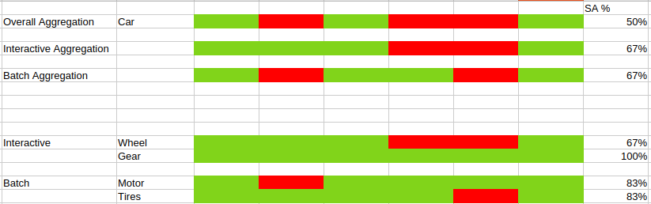

# Service Availability exporter
Developped by Arnaud Lemaignen

This is a Prometheus exporter written in Go that monitors service availability. It queries Kubernetes endpoint metrics from Prometheus to determine if services are available and exposes aggregated service availability (SA) metrics.
It is an alternative to the [black box exporter](https://github.com/prometheus/blackbox_exporter) but is only compatible with http endpoint using a Kubernetes SVC (NodePort or ClusterIP). The main benefit here is to calculate the overall service availability of a software product.
For instance let's say you have a software product called "Car" in that car, you have the "Motor","Tires" which are batch/backend services and you have the "Wheel", the manual "Gear" which are interactive/frontend services.
Here the name of the game is to calculate the SA for each components of the cars but also the aggregate SA for the batch/interactive components and the overall Car SA.



This would be the representation in the services.json file
```
[
	{"product":"Car","type":"interactive",
		"endpoints": [
			"Wheel","Gear"
		]
	},
	{"product":"Car","type":"batch",
		"endpoints": [
			"Motor",
			"Tires"
		]
	}
]
```
There are 2 prereqs for using the exporter:
- access to prometheus
- kube state metrics exporter to expose [kube_endpoint_address](https://github.com/kubernetes/kube-state-metrics/blob/main/docs/metrics/service/endpoint-metrics.md) metric via the param --resources=endpoints

The exporter implements a "zero always wins" logic: if any endpoint of a service is down, the entire service is marked as unavailable (SA = 0). This applies at three levels:
1. Individual endpoints (per product/type/endpoint)
2. Service type level (interactive vs batch, per product)
3. Overall product level (aggregating both interactive and batch)

## Service Mapping Configuration

Services are configured via JSON files in `resources/services.json` (default) or `mapped-services/` directory (override). Each service defines:
- `product`: Product name (e.g., "Car", "Plane", "Spaceship")
- `type`: Either "interactive" (user-facing) or "batch" (background processing)
- `endpoints`: List of Kubernetes service names (supports regex patterns like `my-svc-.*`)

The exporter automatically loads any JSON file from `mapped-services/` directory if present, overriding the default `resources/services.json`.

Here is a more realistic example with 3 products called Metrics/Logs/Traces
```
[
	{"product":"Metrics","type":"interactive",
		"endpoints": [
			"grafana"
		]
	},
	{"product":"Metrics","type":"batch",
		"endpoints": [
			"prometheus",
			"prometheus-alertmanager",
			"service-availability-exporter",
			"node-exporter",
			"kube-state-metrics"
		]
	},
	{"product":"Logs","type":"interactive",
		"endpoints": [
			"kibana"
		]
	},
	{"product":"Logs","type":"batch",
		"endpoints": [
			"elasticsearch",
			"logstash",
			"fluentd"
			]
	},
	{"product":"Traces","type":"interactive",
		"endpoints": [
			"tempo"
		]
	},
	{"product":"Traces","type":"batch",
		"endpoints": [
			"otel-collector"
			]
	}
]
```

## Architecture

### Core Components

**main.go** - Application initialization and HTTP server
- Loads environment configuration (`.env` file or environment variables)
- Reads service mappings from JSON files
- Creates two key data structures:
  - `mapKeyType`: maps service types ("interactive"/"batch") to endpoint lists
  - `mapKeyEndpoint`: maps endpoints to product names (supports regex matching)
- Registers the Prometheus exporter
- Exposes `/metrics` endpoint on port 9800 (default)

**collector.go** - Prometheus collector interface implementation
- Defines the `Exporter` struct
- Implements `Describe()` and `Collect()` methods required by prometheus.Collector
- Defines four metric types:
  - `sa_prom_up`: Prometheus connectivity status
  - `sa_service`: Per-endpoint service availability
  - `sa_service_type`: Per-type (interactive/batch) aggregated SA
  - `sa_service_overall`: Overall product SA

**collector_prom.go** - Core business logic
- `GetMetricSaInternal()`: Queries Kubernetes endpoint metrics to calculate SA per endpoint
  - Uses `kube_endpoint_address` metric (counts total addresses)
  - Uses `kube_endpoint_address{ready="false"}` (counts not-ready addresses)
  - Calculates ready addresses = total - not_ready
  - If ready > 0, SA = 1.0; if ready = 0, SA = 0.0
- `HitProm()`: Orchestrates metric collection and aggregation
- `ZeroAlwaysWin()`: Implements the core SA aggregation logic
- `FindProductsForEndpoint()`: Maps endpoints to products using regex patterns

**api_prom.go** - Prometheus API client wrapper
- `PromQuery()`: Executes instant queries
- `PromQueryRange()`: Executes range queries (currently unused)
- `PromSeries()`: Lists time series (currently unused)


## Build and Test Commands

### Building
```bash
# Build using the provided script (includes tests)
./build.sh

# Manual build
cd go
CGO_ENABLED=0 GOOS=linux go build -o ../bin/sa-exporter .
```

The build script:
1. Runs unit tests with coverage
2. Builds the binary to `bin/sa-exporter`
3. Uses `CGO_ENABLED=0` for static linking

### Testing
```bash
# Run all tests with coverage
cd go
go test -v -cover -coverprofile=coverage.out

# Run a specific test
cd go
go test -v -run TestFunctionName

# Run tests with more verbose output
cd go
go test -v -cover
```

Note: Tests change working directory to `../test` during initialization (see `TestMain` in main_test.go:19-41). Test data is in `test/mapped-services/` directory.

### Docker
```bash
# Build Docker image
docker build -t service-availability-exporter .

# Run with docker-compose
docker-compose up
```

## Environment Variables

Required:
- `PROM_ENDPOINT`: Prometheus server address (e.g., `prometheus:8080`)

Optional:
- `PROMETHEUS_AUTH_USER`: Basic auth username
- `PROMETHEUS_AUTH_PWD`: Basic auth password
- `SA_INTERACTIVE_AGGR`: Time aggregation for interactive services (default: `1m`)
- `SA_BATCH_AGGR`: Time aggregation for batch services (default: `5m`)

Environment variables can be set via `.env` file or container environment.

## Key Implementation Details

### PromQL Queries
The exporter builds dynamic PromQL queries based on service mappings:
```
sum by (endpoint)(kube_endpoint_address{endpoint=~"endpoint1|endpoint2|..."})
sum by (endpoint)(kube_endpoint_address{endpoint=~"endpoint1|endpoint2|...",ready="false"})
```

### Regex Endpoint Matching
Endpoints in service configuration support regex patterns. For example:
- `my-svc-.*` matches any gateway agent
- `^my-svc$` matches exactly "kafka"
- `my-svc$` matches with anchor

### Service Availability Calculation Flow
1. Query total endpoint addresses from kube_endpoint_address
2. Query not-ready addresses from kube_endpoint_address{ready="false"}
3. Calculate ready addresses = total - not_ready
4. Convert to binary: if ready > 0 then SA=1.0, else SA=0.0
5. Aggregate per-type: if any endpoint SA < 1.0 then type SA=0.0
6. Aggregate overall: if any type SA < 1.0 then overall SA=0.0

### Test Organization
Tests are comprehensive (689 lines) and include:
- Unit tests for all major functions
- Edge case testing (empty inputs, regex patterns, error paths)
- Benchmark tests for performance-critical functions
- Integration-style tests that verify the full initialization flow

The test suite achieves high code coverage and uses table-driven tests for thorough validation.

## Working with the Code

When modifying service availability logic, remember:
- The "zero always wins" principle is fundamental to the architecture
- Changes to metric collection should maintain the three-level aggregation hierarchy
- Regex patterns in service mappings are compiled at runtime for each query
- The exporter queries Prometheus synchronously on each `/metrics` scrape

When adding new products:
- Update the appropriate JSON file (resources/services.json or create one in mapped-services/)
- Follow the existing pattern of defining interactive and batch endpoints
- Use regex patterns for endpoint groups that follow naming conventions
- Test with actual Prometheus queries to verify endpoint names match
